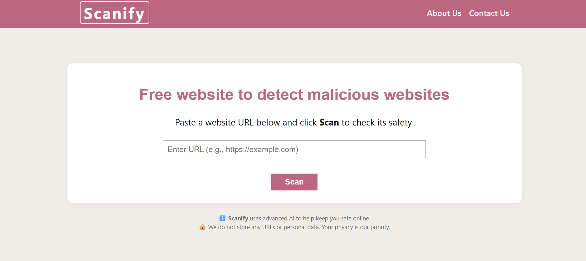

# Detect Malicious Websites with Hybrid Transformer Model
## Project Description
The Detected URL Malware Website is a web application designed to determine whether a website is malicious or safe. It uses a trusted standard security API for detection and modern tools to provide a simple, user-friendly interface.
This system aims to protect users by detecting and classifying URLs as either safe of malicious.
The backend was developed using Flask to process requests and run the AI model, while the frontend was built using React to provide a clean, simple, and user-friendly interface. 
The malicious URL detection system uses a hybrid AI model that merges text-based language understanding from the fine-tuned DistilBERT model with 45 numeric URL features, making predictions based on both structural and textual information from URL’s structure and webpage content.


# Features

+ **Data Ingestion & Dataset:** Uses the Kaggle Web page Phising Detection Dataset that contains 11,430 URLs, divided equally between 50% phishing and 50% benign URLs. The dataset serves as a benchmark for machine learning-based phishing detection systems.  
Each URL in the dataset is represented by 87 extracted features from URL structure, webpage content, and external services.
+ **Data Feature Extraction:** Extracts 45 key numeric features alongside tokenized webpage content for input into the model.
+ **Hybrid AI Model:** Combines text-based language understanding from the fine-tuned DistilBERT model with 45 numeric URL features.
+ **Backend API:** The backend is implemented using Flask to access the data, process it, and return a result.
+ **Frontend Interface:** React allows users to input URLs and receive real-time detection results.

## Tech Stack
+ **Frontend:** React
+ **Backend:** Flask, Python
+ **AI/ML:** Hugging Face Transformers (DistilBERT), PyTorch, NumPy, BeautifulSoup

## Prerequisites

+ Git
+ Python 3.12 (Some dependencies are incompatible with Python 3.13+)
+ Flask
+ React
+ Node.js and npm

## Installation

Clone the repository:

```bash
git clone https://github.com/willettek27/Senior-Sem.git
```

Change to the project's directory:
```bash
cd Senior-Sem
```

Install Backend dependencies:
```bash
pip install -r requirements.txt
```

Install Frontend dependencies:
```bash
npm install
```

## Usage

To start the Backend server
Run:
```bash
python app.py
```
To Set up Frontend
Run:
```bash
cd Senior-Sem
cd malicious-detector-frontend
npm run dev
```

Open your browser and visit http://localhost:5173/ to access the frontend web application.

## Screenshots
<p align="center">
  


